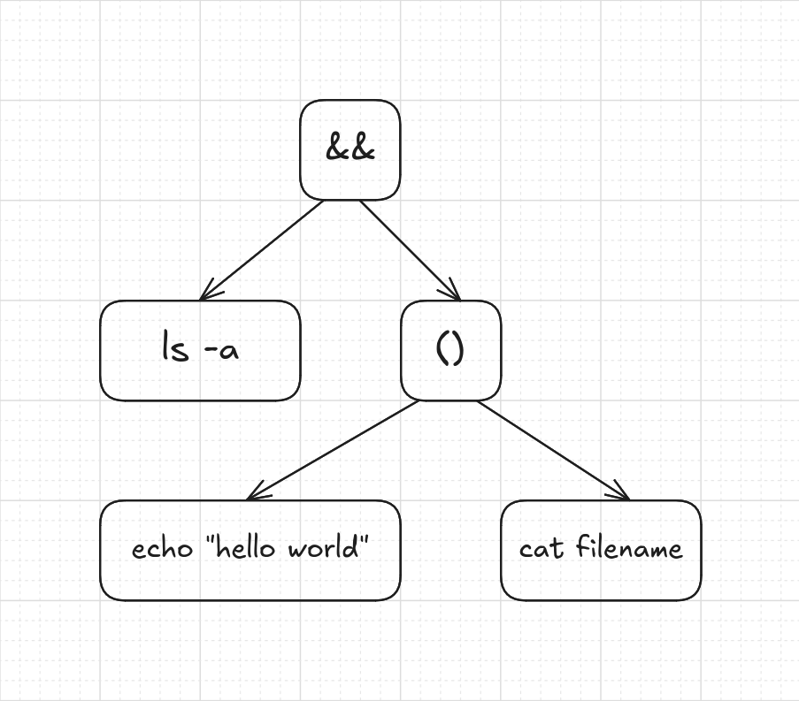

<!--toc:start-->

- [TODO:](#todo)
- [Parts of a shell Program](#parts-of-a-shell-program)
  - [The Parser](#the-parser)
  - [The Executor](#the-executor)
- [Shell Subsystems](#shell-subsystems)
- [Using Lex and Yacc to implement the Parser](#using-lex-and-yacc-to-implement-the-parser)
- [Representing Code aka (Given Line)](#representing-code-aka-given-line)
<!--toc:end-->

## TODO:

- Create a Lexer
- Generate Abstract Syntax Three based on the tokens given from the lexer

## Parts of a shell Program

The shell implementation is divided into three parts:

- **The Parser**
- **The Executor**
- **Shell Subsystems**

### The Parser

The parser is the software component that reads the command line, and puts it into a data structure
**Command Table** that will store the commands that will be executed.

### The Executor

The executor will take the command table generated by the parser, and for every command, it will create a new process.

It will also if necessary create pipes for communication between process.

It will redirect the standard input, output and error is there are any redirections.

Type of redirections:

- `>`: redirect the output of the command to an _outfile_

```bash
    ls -la > outfile
```

- `<`: input of the first command is redirected from the _infile_

```bash
    cat < infile
```

Example of a sequence of commands with redirections

```bash
cat | wc -l > tmp < hello
```

Shell redirect the content of _hello_ file as an input to the `cat` command.

`wc -l` uses the output of `cat` as an input, then output will be redirected to the tmp file

- if **tmp** exist:
  -> It's content will be overwritten
- if **tmp** does not exist:
  -> tmp file would be created, with the redirected content

## Shell Subsystems

There are other subsystems that complete the shell which are:

- **Environment Variables**: The shell should be able to _set_, _expand_ and _print_ environment variables
  of the form `$VAR` or `${VAR}`

- **Wildcards**: The wildcards of the form `*` or `a*a` should be expanded to all the files that match them in the local directory
  and multiple directories.

- **Subshells**: Not required but why not!!, `command` or `$(command)`
  commands are executed in a subshell, it's output is sent as input to the shell.

## Using Lex and Yacc to implement the Parser

we will use two UNIX tools to implement a parser: **Flex** and **Yacc**. These tools are used to
implement _compilers_, _interpreters_, and _preprocessors_.

Lexer: _Lexical analysis_, _tockenization_ is the process of converting a sequence of _characters_ into a meaningful sequence of lexical tokens

Yacc: yet another compiler compiler is a parser generator for compilers

`cmd [arg]*`: each command can be represented as a _command_name + argument_

- command name **cmd**
- 0 or more argument for the command

A simple pipe contains 2 or more commands:

`cmd [arg]* [ | cmd [arg]* ]*`

- a command with 0 or more arguments
- a pipe `|`
- othre command with 0 or more argument

a command can have one or more input, output redirections

`[[[> filename] [>> filename]] [< filename]]*`

if there are one or more filenames, last file in the list will be used, since files overwrite each other

if one of the files don't have permissions, file i/o stops.

## Representing Code aka (Given Line)

In The process of Parsing, We took the raw line and transformed it into a slightly higher-level representation: a series of tokens,
then takes these tokens and transforms them yet again, into an even richer complex representation.

NOTE: The main goal: the representation should be sipmle for the parser to produce and easy for the interpreter to consume.

For example when evaluating `1 + 2 * 3 - 4`, we know that the multiplication is evaluated before the addition of subtraction,
one way to visulaize that prcedence is using a tree Leaf nodes are numbers, and interior nodes are operators with branches for each of their operands.

In order to evalure an arithmetic node, you need to know the numeric valuesof its subtrees, so you have to evaluate those first.
That means working your way from the leaves up to the root, in a _post-order_ traversal:


A. Starting with the full tree, evaluate the bottom-most operation, `2 * 3`.

B. Now we can evaluate the `+`.

C. Next, the `-`.

D. The final answer.

### Generating the Abstract syntax tree

When dealing with trees, specifically when debugging, we need to print the tree, that's called **pretty printin**

When the goal is to produce a string of text that is valid syntax in the source language.

We want the string to very explicitly show the nesting structure of the tree, Code that print `1 * 2 * 3` isn't helpful.

For example:

```bash
ls -a && (echo "hello world" || cat filename)
```

Given the syntax tree like:



Pretty printer produces:

```
(&& (ls -a) (group (echo "hello world") (cat filename)))
```
